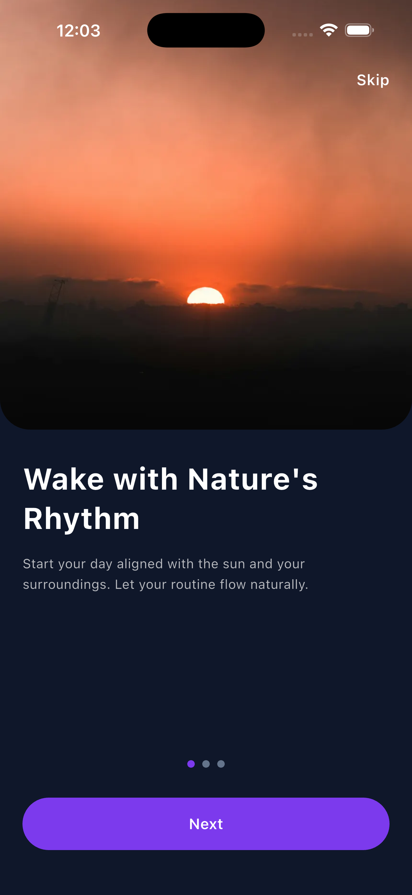
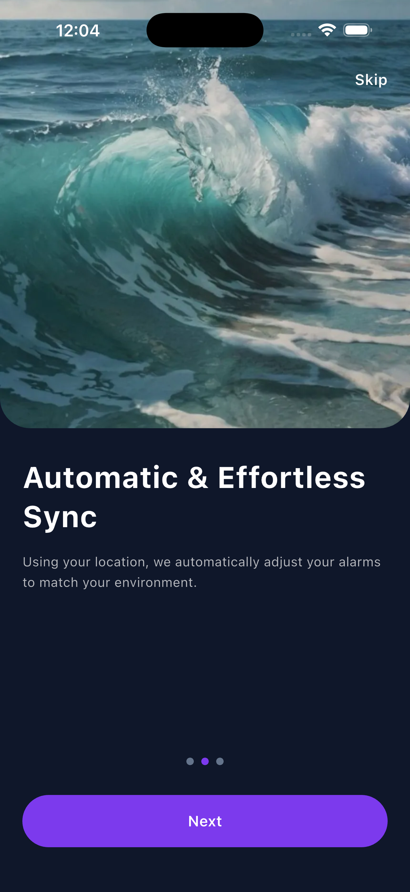
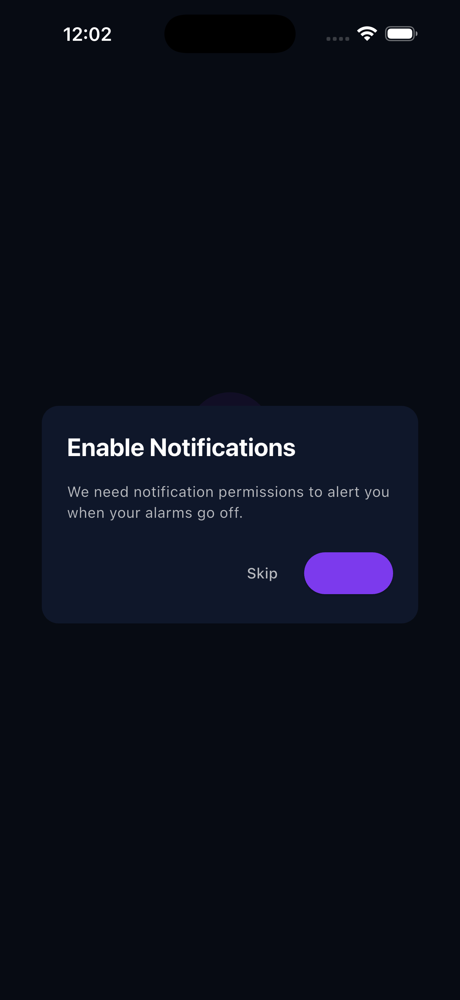
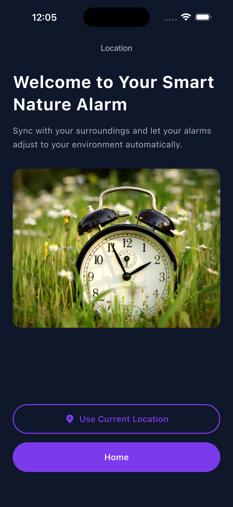
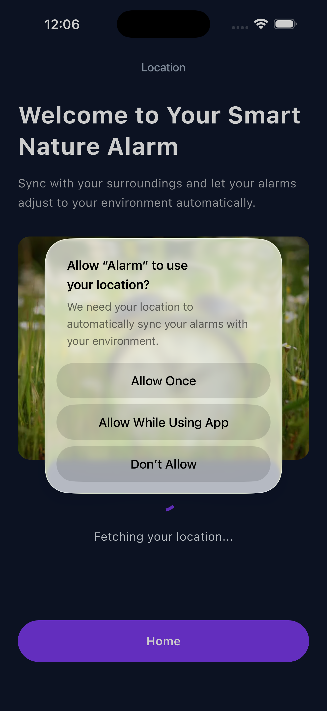
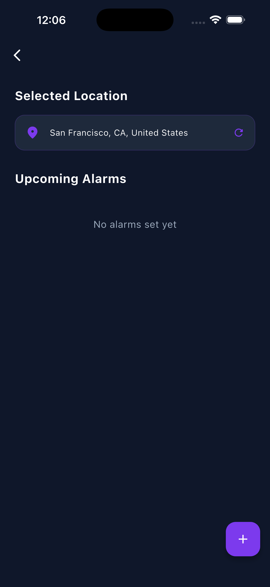
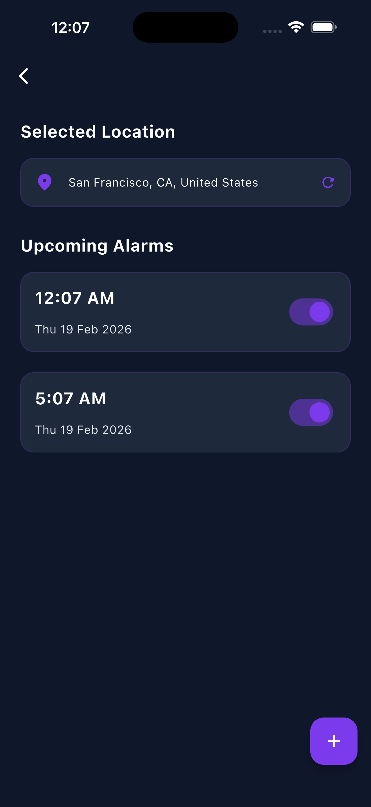
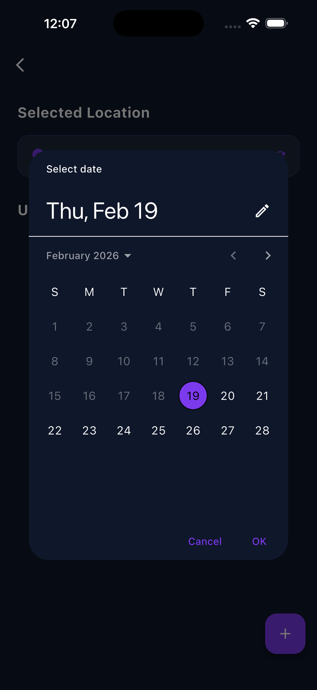
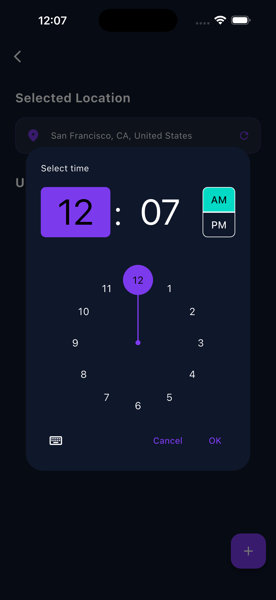

# Flutter Smart Alarm App
## Features

✅ **Beautiful Onboarding Flow** - Data-driven onboarding screens with PageView navigation  
✅ **Location Services** - GPS location detection with reverse geocoding (coordinates → address names)  
✅ **Alarm Management** - Create, edit, delete, and toggle alarms with persistent storage  
✅ **Smart Notifications** - Timezone-aware scheduling with exact and inexact alarm fallback  
✅ **Local Database** - SQLite storage for reliable alarm persistence  
✅ **Material Design 3** - Modern, clean UI with consistent styling  
✅ **Cross-Platform** - Fully optimized for iOS, Android, macOS, Linux, and Windows  

---

## Project Setup Instructions

### Prerequisites

- **Flutter SDK**: 3.10.1+
- **Dart SDK**: 3.10.1+
- **Android**: API level 21 or higher (for full functionality, API 31+ recommended)
- **iOS**: 11.0 or higher
- **macOS**: 10.13 or higher

### Installation Steps

#### 1. Clone the Repository
```bash
git clone https://github.com/kaziasif/Flutter_Onboarding_App_Softvence.git
cd Flutter_Onboarding_App_Softvence
```

#### 2. Install Dependencies
```bash
flutter pub get
```

#### 3. Generate App Icons (Optional)
```bash
flutter pub run flutter_launcher_icons:main
```

#### 4. Run the App

**On Android:**
```bash
flutter run -d android
```

**On iOS:**
```bash
flutter run -d ios
```

**On macOS:**
```bash
flutter run -d macos
```

**On Web:**
```bash
flutter run -d web
```

---

## Tools & Packages Used

### Core Framework
- **Flutter**: ^3.10.1 - UI framework
- **Dart**: ^3.10.1 - Programming language

### Location Services
- **[geolocator](https://pub.dev/packages/geolocator)** ^9.0.2 - GPS location detection and permissions
- **[geocoding](https://pub.dev/packages/geocoding)** ^2.1.1 - Reverse geocoding (lat/lng → address)

### Data Persistence
- **[sqflite](https://pub.dev/packages/sqflite)** ^2.3.2 - SQLite database for alarm storage
- **[shared_preferences](https://pub.dev/packages/shared_preferences)** ^2.2.2 - Key-value storage for app state
- **[path](https://pub.dev/packages/path)** ^1.8.3 - Database path helpers

### Notifications & Scheduling
- **[flutter_local_notifications](https://pub.dev/packages/flutter_local_notifications)** ^17.0.0 - Local push notifications
- **[timezone](https://pub.dev/packages/timezone)** ^0.9.2 - Timezone-aware scheduling

### Utilities
- **[intl](https://pub.dev/packages/intl)** ^0.19.0 - Internationalization and date/time formatting
- **[cupertino_icons](https://pub.dev/packages/cupertino_icons)** ^1.0.8 - iOS-style icons

### Development Tools
- **[flutter_launcher_icons](https://pub.dev/packages/flutter_launcher_icons)** ^0.14.4 - App icon generator
- **[flutter_lints](https://pub.dev/packages/flutter_lints)** ^6.0.0 - Recommended Dart linting rules

---

## Project Structure

```
lib/
├── main.dart                          # App entry point & navigation logic
├── screens/
│   └── splash_screen.dart            # Initial splash with permission dialog
├── constants/
│   ├── app_colors.dart               # Color palette (Material 3)
│   ├── app_dimensions.dart           # Spacing, border radius, font sizes
│   ├── app_strings.dart              # UI text constants
│   └── index.dart                    # Constants barrel export
├── features/
│   ├── onboarding/
│   │   ├── screens/
│   │   │   ├── onboarding_screen_content.dart     # Branded screens
│   │   │   └── onboarding_flow_screen.dart        # PageView controller
│   │   ├── models/
│   │   └── index.dart
│   ├── location/
│   │   ├── screens/
│   │   │   └── location_access_screen.dart        # Permission & location selection
│   │   ├── models/
│   │   │   └── location_model.dart                # Location data structure
│   │   ├── services/
│   │   │   └── location_service.dart              # GPS & geocoding logic
│   │   └── index.dart
│   ├── alarm/
│   │   ├── screens/
│   │   │   └── home_screen.dart                   # Alarm management UI
│   │   ├── models/
│   │   │   └── alarm_model.dart                   # Alarm data structure
│   │   ├── services/
│   │   │   ├── alarm_service.dart                 # CRUD operations
│   │   │   ├── database_service.dart              # SQLite management
│   │   │   └── notification_service.dart          # Notification scheduling
│   │   └── index.dart
│   └── common_widgets/
│       ├── primary_button.dart
│       └── page_indicator.dart
├── assets/
│   └── images/
│       ├── location1.jpg
│       └── app_icon.png
└── analysis_options.yaml             # Lint rules
```

---

## Key Features Explained

### 🎨 Onboarding Flow
Three customizable onboarding screens with:
- Auto-scrolling PageView
- Animated page indicators
- Skip button with early exit option
- Smooth transitions to next phase

### 📍 Location Services
- Async GPS location detection with permission handling
- Reverse geocoding to display human-readable addresses
- Platform-specific permission requests (iOS, Android, macOS)
- Graceful error handling and user-friendly messages

### ⏰ Alarm Management
- SQLite database for persistent storage
- Real-time list updates
- Edit and delete functionality
- Toggle alarms on/off without deletion
- Date and time picker UI

### 🔔 Smart Notifications
**Notification Types:**
- **Exact Alarms** (Android 12+): High precision scheduling via `AlarmManager`
- **Inexact Alarms**: Fallback with ±10-15 minute window when exact permissions denied
- **Immediate Alarms** (< 2 minutes): Uses app-based `Future.delayed` workaround

**Features:**
- Timezone-aware scheduling
- Full-screen intents with vibration
- Custom notification channel (MAX importance)
- Critical interruption level for iOS

### 💾 Data Persistence
- **Alarms**: SQLite database with timestamp sorting
- **App State**: SharedPreferences for:
  - First launch detection
  - Permission request tracking
  - Last selected location

---

## Screenshots

### Onboarding Flow
Three beautiful onboarding screens with full-height images, clear CTAs, and animated indicators:

<div align="center">
  
  
  
</div>

### Notification Permission Dialog
First-launch permission request with skip/allow options:

<div align="center">
  
</div>

### Location Setup
Location access screens with GPS detection and location selection:

<div align="center">
  
  
</div>

### Alarm Management
Complete home screen showing alarms with current location, refresh, and management options:

<div align="center">
  
  
</div>

### Create/Edit Alarm
Date and time picker interface for creating and editing alarms:

<div align="center">
  
  
</div>

---